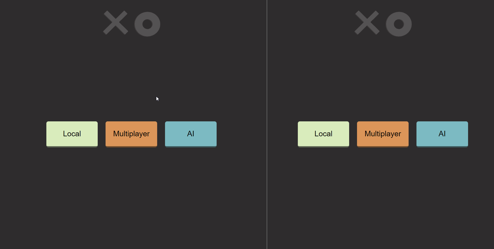
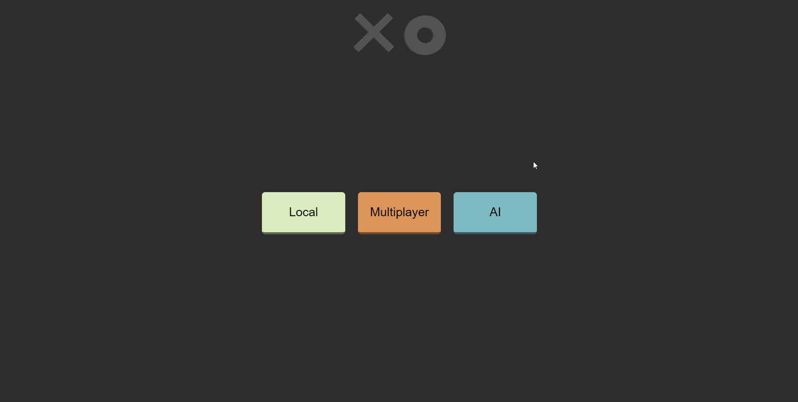
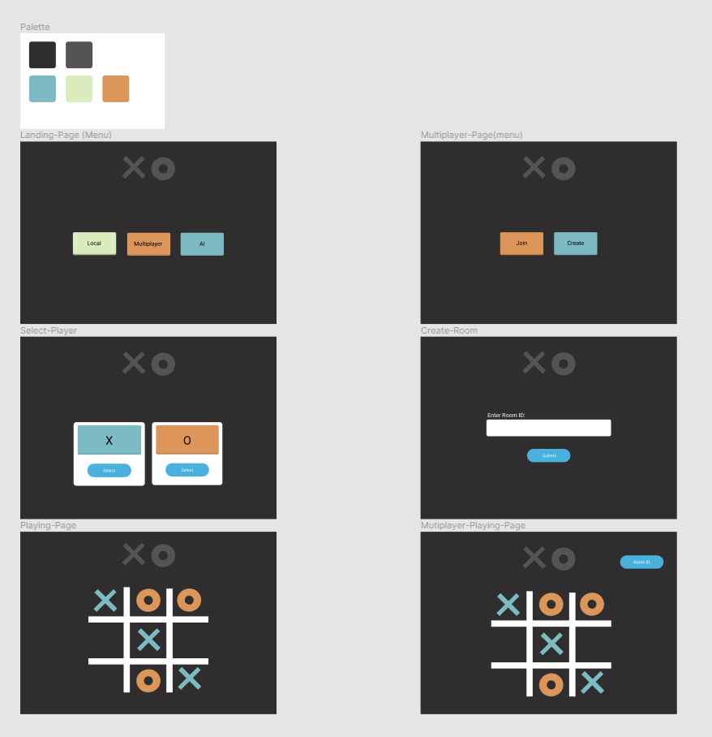

# Tic-Tac-Toe Project

## Description

A basic project to get more experience with designing and creating a website.

---

## How I approached styling 

For this project, I decided to use the CUBE CSS methodology. Previously for styling, I was pixel-pushing/winging it, which 
caused a lot of inconsistencies and extra work. I referred to the docs frequently to make sure I was following the 'rules'
they detailed; however, I may have written some CSS that may not abide by the rules, but I will get better with more practice.

---

## WalkThroughs

### Local game 

### Multiplayer game 

### AI game 

---

## Design 

---

## Resources

- Styling
    - How I got an Introduction to CUBE CSS [Kevin Powell video](https://www.youtube.com/watch?v=NanhQvnvbR8&ab_channel=KevinPowell)
    - CUBE CSS [Docs](https://cube.fyi/)
- Sockets
    - How I got an Introduction to sockets [fireship video](https://www.youtube.com/watch?v=1BfCnjr_Vjg&t=416s&ab_channel=Fireship)
    - Socket IO [Docs](https://socket.io/docs/v4/)